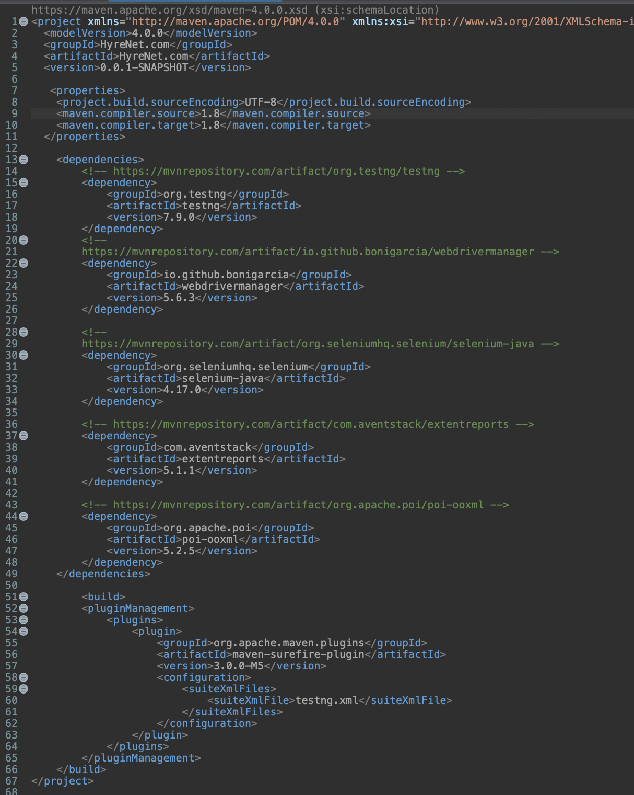
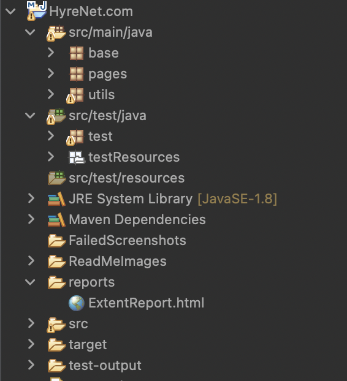
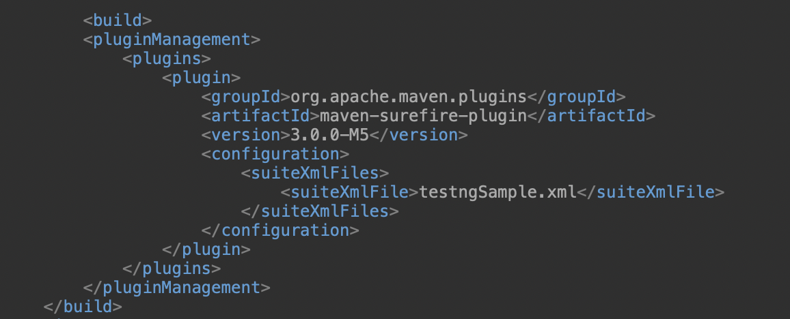

# HyreNet Automation framework:

<p align="Left"></p>

This project is meant for testing the major functionalities of HyreNet site. I have used Data-Driven testing for testing Sign In functionality with Data provider. Also, this project covers the main features like creating test and creating template for the drive.

## Motivation:
The reason behind creating this framework is to automate the main modules of HyreNet with efficient code strategy and bug finding mechanisms to report  bugs with failed screenshot.

## Coding Style:
- I have used Java language with POM(Page Object Model) design pattern with Selenium framework in this project.

## IDE/Language:
- IDE : Eclipse
- Language : Java

## Technology/Frameworks used:
- TestNG framework - Used for various purposes like Data provider and the prioritization of tests and suites.
- Extent reports library - Used for the detailed reporting the test cases status with various information like screenshots.
- Maven project - For the ease of handling the dependencies in one place.
- Selenium Java library - Selenium provides support for the automation of web browsers. It provides extensions to emulate user interaction with browsers, a distribution server for scaling browser allocation, and the infrastructure for implementations of the W3C WebDriver specification.
- Apache POI library- For the reading and writing the data in  Excel sheet.
- Maven Surefire plugin- For the building a Maven build in order to use it for Jenkins CI/CD implementation for invoking the build by local host or remotely.
- Jenkins tool - For triggering the build eventually executing the tasks locally or remotely.
- WebDriverManager library - Automated driver management and other helper features for Selenium WebDriver in Java.
- Property file - To store the test data that will be used globally inside the framework

## Steps to create project and adding dependencies:
- Step 1 : Create a new project of type Maven in Eclipse IDE.
- Step 2 : Then add a testNG library by navigating to Java build path and adding testNG library. Then Apply and close.
- Step 3 : Next step is to add the important dependencies in the Pom.xml file(refer to the below dependencies screenshot).
- Step 4 : Since we are following POM design pattern we need to create four packages(refer to the below POM screenshot).
- Step 5 : Finally, add the Maven sure surefire plugin in the Pom.xml file under tag <build></build>(refer to the below Maven surefire screenshot).
- Step 6 : Create a new testng.xml file adding the test java classes to be executed under suite.
- Step 7 : Run the project a testNG suite.

## Dependencies screenshot:
<p align="Left"></p>

## POM file screenshot:
<p align="Left"></p>

## Maven surefire screenshot:
<p align="Left"></p>

## Test case Code Example:
- I have used constructor chaining here in order to access the methods of pages with single object creation.
- We are using try/catch to handle the exception that occurs in between the process of executing a test case.
- Finally, based on the validation if the test case is passed we report that test case as Pass/Fail in extent report.

## Test Scenarios covered:
- URL is broken or not
- Signin scenarios(Positive and Negative)
- SignUp scenarios(Positive and Negative)
- Loguout scenario
- Create Test Drive scenario
- Create new Template scenario
- Create new question in Qlibrary
- Update Test End page details

## Jenkins success build run screenshot:
<p align="Left"></p>

## People worked on this project
```Maginthan```
